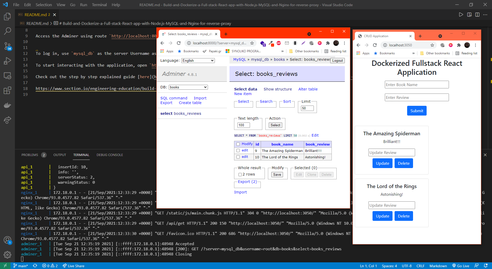

# Build-and-Dockerize-a-Full-stack-React-app-with-Node.js-MySQL-and-Nginx-for-reverse-proxy

Run `npm i` inside the client directory

Run `npm i` inside the server directory

Run `docker-compose up --build` inside the mainn project directory
#### Alternatively you can run under bash / (git bash) the file prepare.sh that does all the previous steps!

Access the Adminer using route `http://localhost:8000/`.

To log in, use `mysql_db` as the server Username as `root` and password as `MYSQL_ROOT_PASSWORD`.

To start interacting with the application, open `http://localhost:3050/` on a browser.

Check out the step by step explained guide [here](https://www.section.io/engineering-education/build-and-dockerize-a-full-stack-react-app-with-nodejs-and-nginx/)

https://www.section.io/engineering-education/build-and-dockerize-a-full-stack-react-app-with-nodejs-and-nginx/
